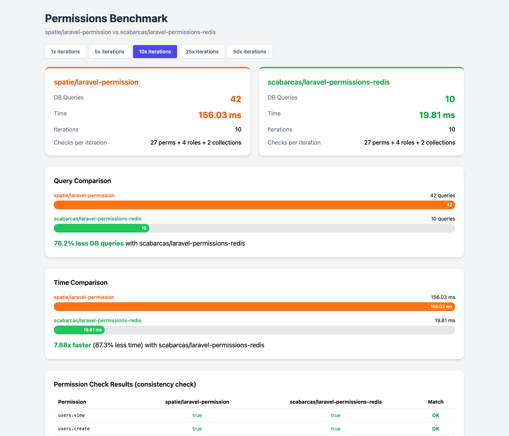
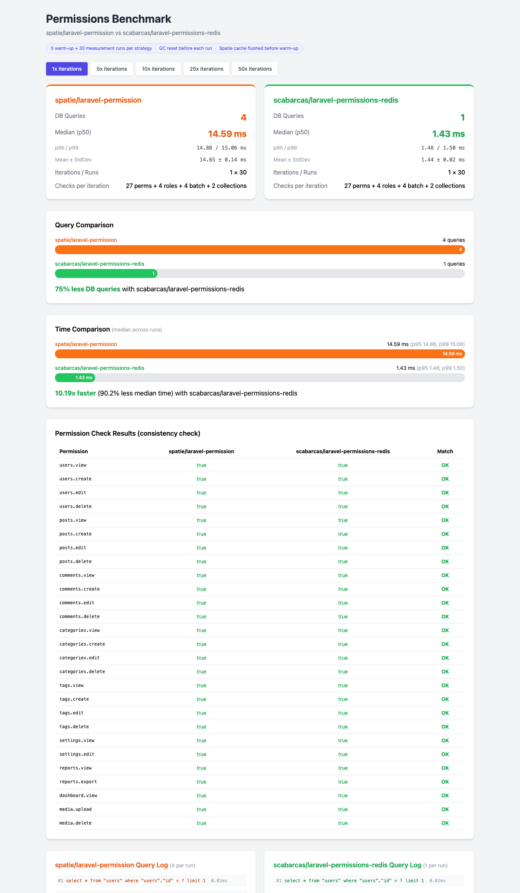
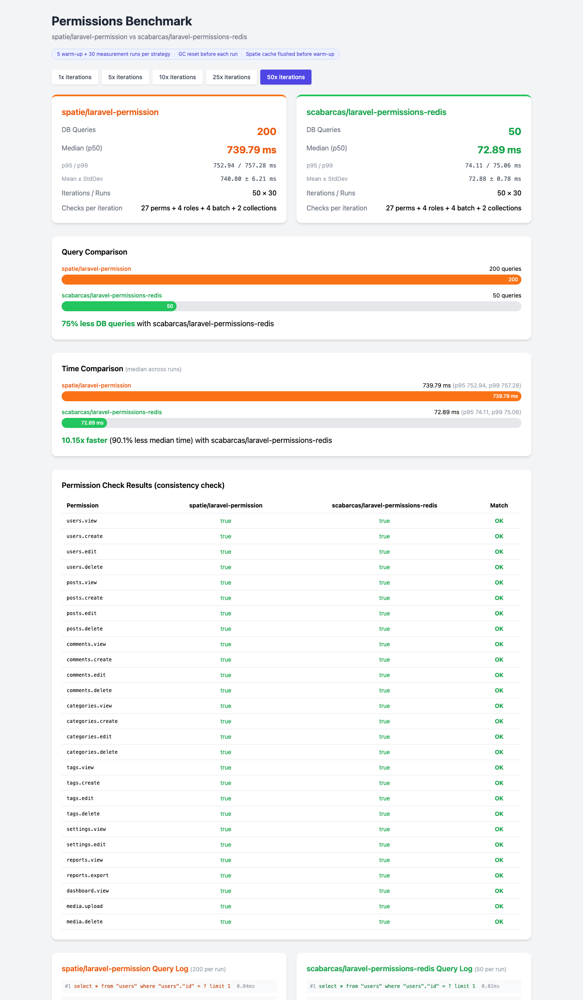
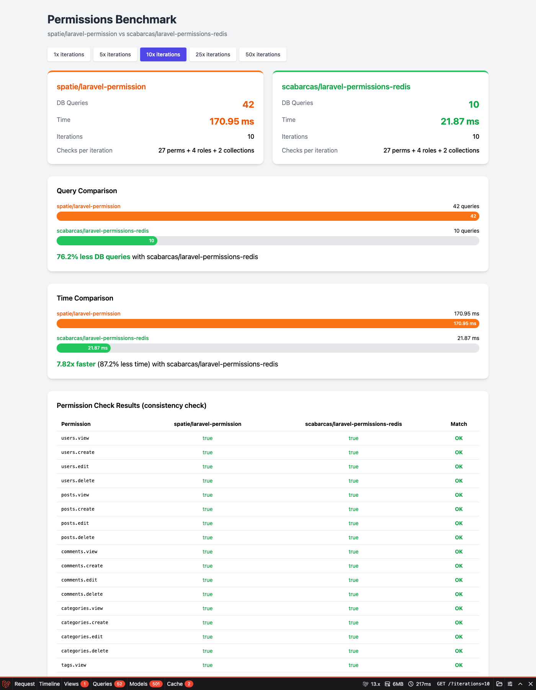

# Laravel Permissions Benchmark

A side-by-side benchmark comparing database query performance between [spatie/laravel-permission](https://github.com/spatie/laravel-permission) and [scabarcas/laravel-permissions-redis](https://github.com/scabarcas17/laravel-permissions-redis).

## Results

### 1 Iteration (27 permission checks + 4 role checks + 2 collection calls)

| Metric | spatie/laravel-permission | scabarcas/laravel-permissions-redis |
|--------|:------------------------:|:-----------------------------------:|
| **DB Queries** | 5 | 1 |
| **Reduction** | — | **80% fewer queries** |

### 10 Iterations

| Metric | spatie/laravel-permission | scabarcas/laravel-permissions-redis |
|--------|:------------------------:|:-----------------------------------:|
| **DB Queries** | 14 | 10 |
| **Reduction** | — | **~29% fewer queries** |

### 50 Iterations

| Metric | spatie/laravel-permission | scabarcas/laravel-permissions-redis |
|--------|:------------------------:|:-----------------------------------:|
| **DB Queries** | 54 | 50 |
| **Reduction** | — | **~7% fewer queries** |

> The Redis package resolves all permission and role checks from Redis after the initial cache warm. The only DB queries are the `SELECT * FROM users WHERE id = ?` calls to load the User model on each iteration.

## Screenshots

### Dashboard Overview


### Query Comparison (1x iteration)


### Query Comparison (50x iterations)


### Debugbar Query Analysis


## What is being tested?

On each iteration the benchmark performs:

- **27 permission checks** — `hasPermissionTo()` for every seeded permission
- **4 role checks** — `hasRole()` for admin, editor, viewer, and a nonexistent role
- **2 collection calls** — `getAllPermissions()` and `getRoleNames()`

Both packages operate on the **same database tables** and the **same user data**, ensuring a fair comparison. A consistency table verifies that both packages return identical results for every check.

## Quick Start with Docker

```bash
git clone https://github.com/scabarcas17/laravel-permissions-redis-benchmark.git
cd laravel-permissions-redis-benchmark
docker compose up -d
```

Open **http://localhost:8080** in your browser.

## Quick Start (Local)

### Requirements

- PHP 8.3+
- Composer
- Redis server running on localhost:6379

### Setup

```bash
git clone https://github.com/scabarcas17/laravel-permissions-redis-benchmark.git
cd laravel-permissions-redis-benchmark

composer install
cp .env.example .env
php artisan key:generate
php artisan migrate:fresh --seed --seeder=BenchmarkSeeder
php artisan serve --port=8080
```

Open **http://localhost:8080** in your browser.

Use the iteration selector (1x, 5x, 10x, 25x, 50x) to see how query counts scale.

## How it works

The benchmark uses two separate Eloquent User models pointing to the same `users` table:

- **`SpatieUser`** — uses `Spatie\Permission\Traits\HasRoles`
- **`RedisUser`** — uses `Scabarcas\LaravelPermissionsRedis\Traits\HasRedisPermissions`

`DB::enableQueryLog()` captures every SQL query made by each package independently. The Redis package's cache is pre-warmed during seeding, simulating a real-world scenario where the cache is populated on user login.

## Tech Stack

- Laravel 13
- spatie/laravel-permission ^7.2
- scabarcas/laravel-permissions-redis (latest)
- barryvdh/laravel-debugbar (open the Debugbar at the bottom for detailed query analysis)
- SQLite + Redis

## License

MIT
